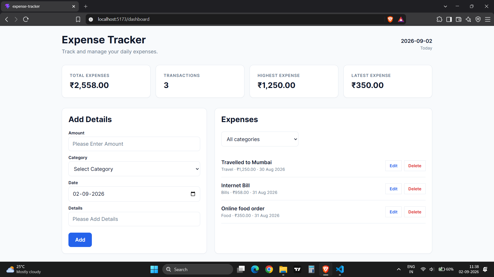
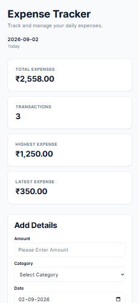
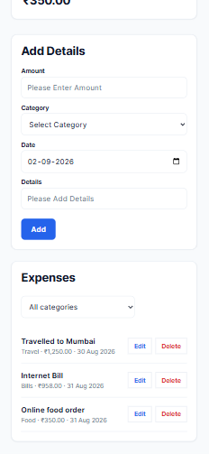

# React Expense Tracker

A responsive expense tracker application built with React and Vite to manage and monitor daily expenses.

The application demonstrates component-based architecture, CRUD operations, controlled forms, derived state, category filtering, localStorage persistence, responsive layouts, clean code organization, and modern frontend development practices.

---

## Live Demo

Live Application: [ADD LIVE URL]

GitHub Repository: https://github.com/pradeepk1787/react-expense-tracker

---

## Screenshots

### Dashboard
### Expense Form
### Expense List


### Mobile




---

## ✨ Features

* ✅ Add new expenses
* ✅ Edit existing expenses
* ✅ Delete expenses
* ✅ Categorize expenses using predefined categories
* ✅ Filter expenses by category
* ✅ Dashboard summary cards
* ✅ Total expenses calculation
* ✅ Highest expense calculation
* ✅ Latest expense tracking
* ✅ Form validation using required fields
* ✅ Controlled form inputs
* ✅ Cancel expense editing
* ✅ Persist expenses using browser localStorage
* ✅ Handle localStorage read and write errors
* ✅ Responsive design for desktop, tablet, and mobile
* ✅ Clean and consistent SaaS-style UI
* ✅ Component-based architecture
* ✅ Deployed on Vercel

---

## Tech Stack

* React
* Vite
* JavaScript (ES6+)
* CSS3
* Git & GitHub
* Vercel
* Browser localStorage

---

## React Concepts Practiced

* Functional Components
* JSX
* Props
* useState
* useEffect
* Controlled Forms
* Event Handling
* Conditional Rendering
* Lists & Keys
* Data-driven Rendering
* Derived State
* State Ownership
* CRUD Operations
* Component Composition
* Separation of Concerns
* Single Responsibility Principle
* Responsive Design
* CSS Grid
* Flexbox
* Browser localStorage
* Error Handling

---

## Project Structure

```text
expense-tracker/
│
├── screenshots/
│   ├── desktop.png
│   ├── mobile-1.png
│   └── mobile-2.png
│
├── public/
│
├── src/
│   ├── components/
│   │   ├── common/
│   │   │   ├── Header.jsx
│   │   │   └── Header.css
│   │   │
│   │   ├── dashboard/
│   │   │   ├── Dashboard.jsx
│   │   │   ├── Dashboard.css
│   │   │   └── SummaryCard.jsx
│   │   │
│   │   ├── expense/
│   │   │   ├── ExpenseForm.jsx
│   │   │   ├── ExpenseForm.css
│   │   │   ├── ExpenseItem.jsx
│   │   │   ├── ExpenseItem.css
│   │   │   ├── ExpenseList.jsx
│   │   │   └── ExpenseList.css
│   │   │
│   │   └── filters/
│   │       └── CategoryFilter.jsx
│   │
│   ├── constants/
│   │   └── storage.js
│   │
│   ├── data/
│   │   ├── categories.js
│   │   └── dashboardCard.js
│   │
│   ├── styles/
│   │   └── globals.css
│   │
│   ├── utils/
│   │   ├── formatCurrency.js
│   │   ├── formatDate.js
│   │   └── storage.js
│   │
│   ├── App.jsx
│   ├── App.css
│   └── main.jsx
│
├── package.json
├── vite.config.js
└── README.md
What I Learned

During this project, I practiced:

Managing shared state across multiple React components
Designing appropriate state ownership and data flow
Building CRUD functionality using React state
Creating controlled forms and handling form events
Working with derived state instead of storing duplicate values
Implementing category-based filtering
Persisting application data using browser localStorage
Handling localStorage read and write errors
Separating storage logic into reusable utility functions
Organizing components using a feature-oriented folder structure
Creating reusable UI components
Designing responsive layouts using Flexbox and CSS Grid
Structuring CSS using reusable variables and consistent spacing
Debugging responsive layout and scrolling issues
Managing source code using Git and GitHub
Deploying React applications using Vercel
Getting Started

Clone the repository:

git clone https://github.com/pradeepk1787/react-expense-tracker.git

Navigate to the project:

cd expense-tracker

Install dependencies:

npm install

Start the development server:

npm run dev

Create a production build:

npm run build
Author

Pradeep Kamble

GitHub: https://github.com/pradeepk1787

Portfolio: https://react-portfolio-eight-beta-69.vercel.app/

Email: pradeepkamble1787@gmail.com

Project Status

✅ Version 1.0 Completed

This project is feature-complete and serves as part of my frontend development learning roadmap.

Future Enhancements

Possible future improvements:

Expense search functionality
Expense sorting
Advanced filtering
Expense charts and visualizations
Monthly expense summaries
Additional dashboard analytics
Backend integration
User authentication
Cloud-based expense persistence
License

This project is created for learning and portfolio purposes.

⭐ Support

If you found this project helpful or interesting, consider giving the repository a Star ⭐ on GitHub.

Feedback and suggestions are always welcome.